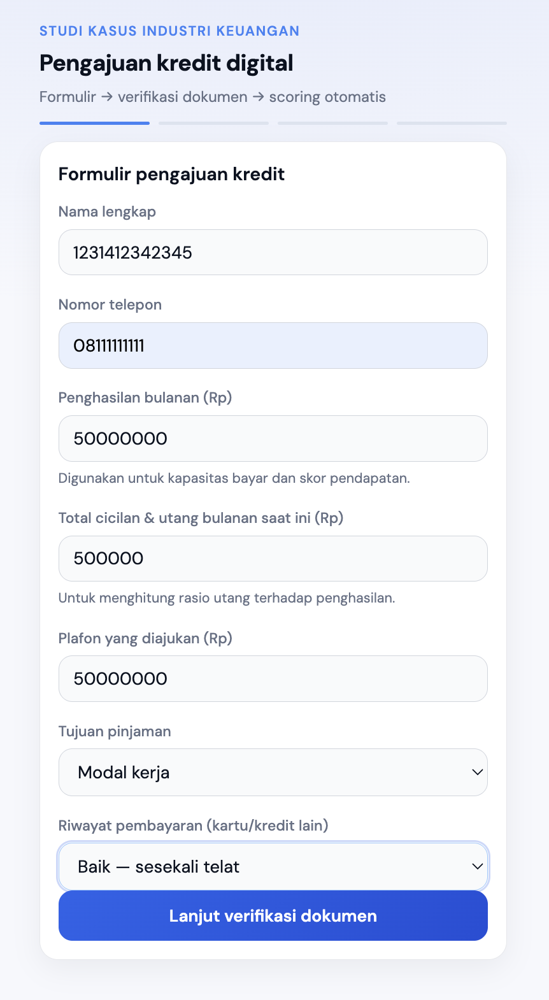
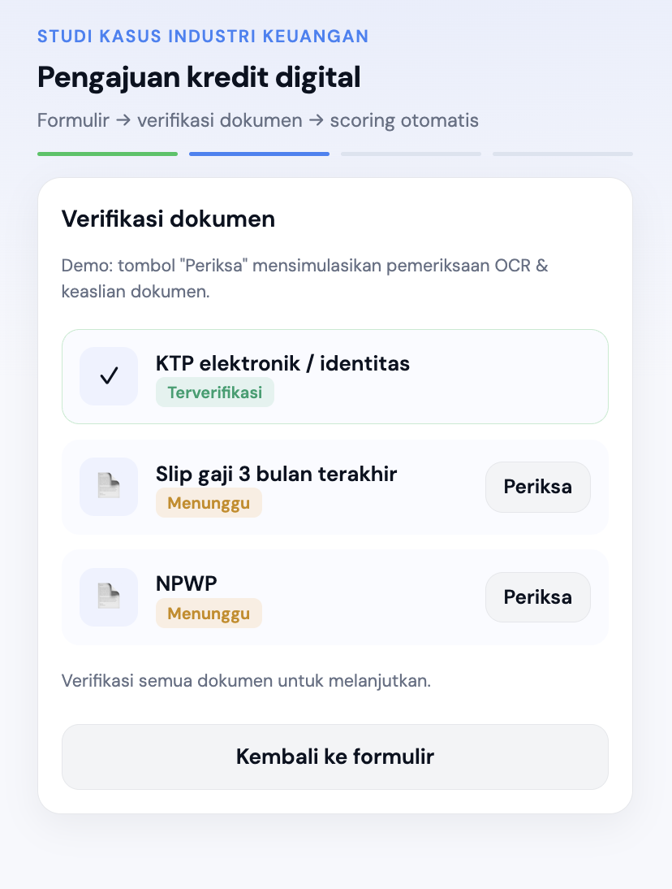
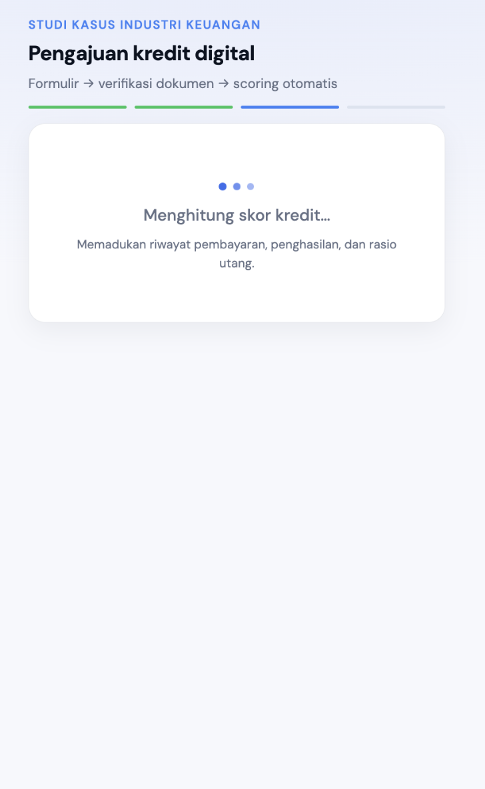
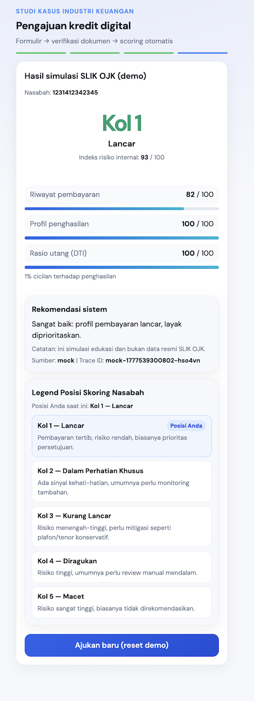

# Dokumentasi proyek

## Workshop (latihan praktik)

Materi hands-on **Frontend–Backend Integration & Debugging** untuk peserta workshop: [`workshop/README.md`](workshop/README.md).

## API

- **Markdown ringkas:** [`api/credit-scoring.md`](api/credit-scoring.md) — termasuk skema **`aegira`** (snake_case, DSR/eligibility) vs **`kreditku`** (legacy), selaras referensi [Aegira Loan Service](https://github.com/khalidalhabibie/aegira-loan-service/blob/master/README.md).
- **OpenAPI 3 (JSON):** [`api/credit-scoring.openapi.json`](api/credit-scoring.openapi.json)

## Visualisasi UI (screenshot per halaman)

Indeks lengkap dengan gambar: [`screenshots/README.md`](screenshots/README.md).

### Pratinjau alur (dari file di repo)

| Langkah | Preview |
|---------|---------|
| Form pengajuan |  |
| Verifikasi dokumen |  |
| Loading scoring |  |
| Hasil scoring |  |

Folder tambahan: [`screenshots/05-error-scoring/`](screenshots/05-error-scoring/) — untuk screenshot error API (UAT), belum ada file gambar.

Cara menambah atau mengganti screenshot: jalankan `npm run dev`, tangkap layar per langkah, simpan ke subfolder yang sesuai di `docs/screenshots/`.
